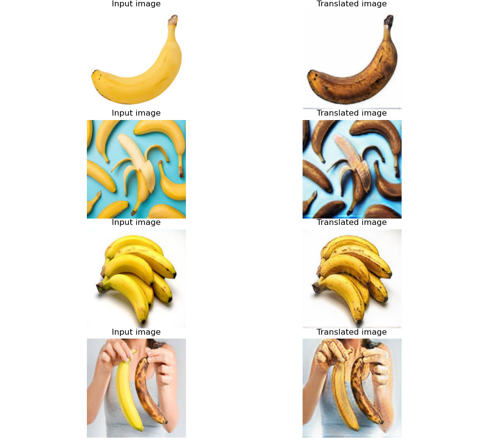
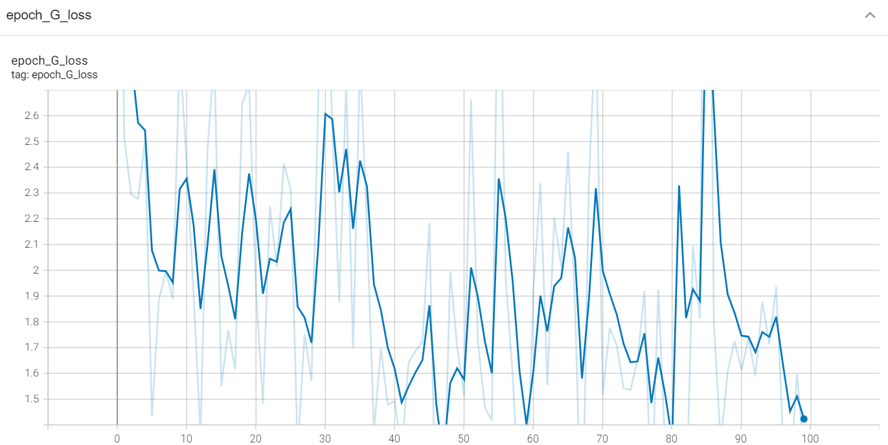
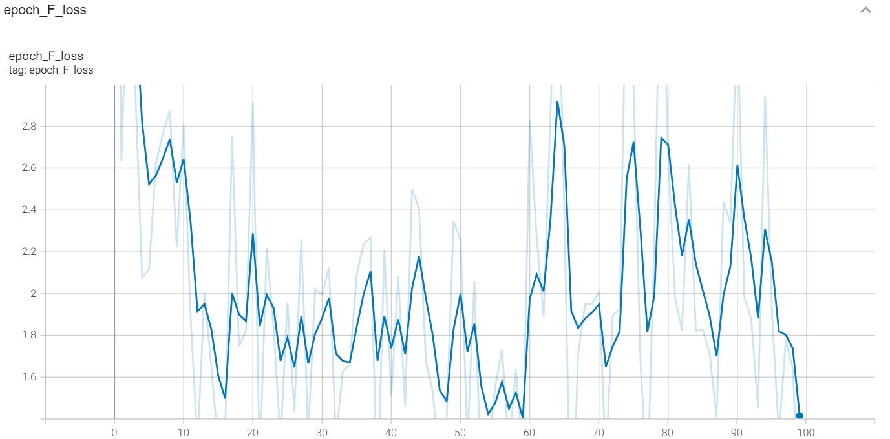
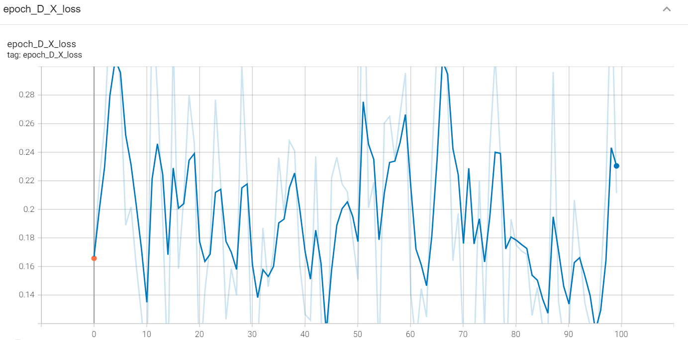
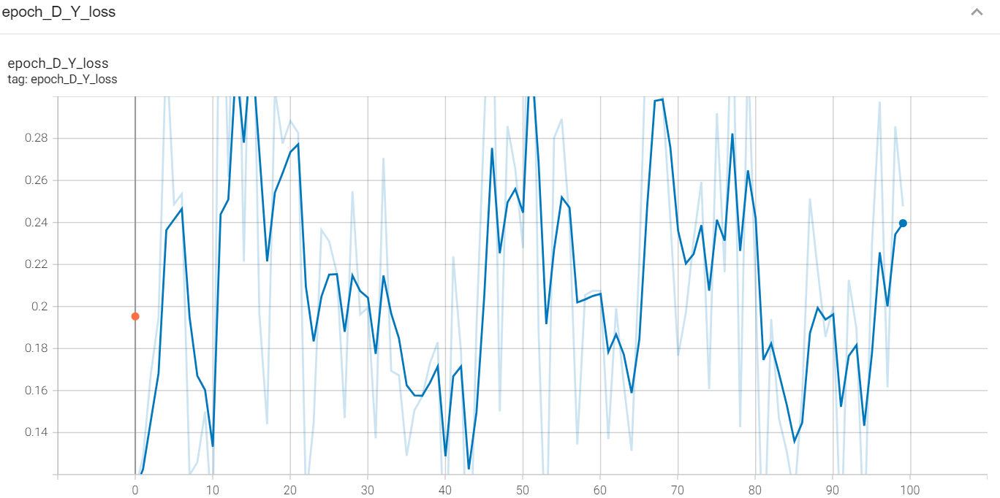

# Tensorflow-Keras - CycleGAN_Attention

Tensorflow-Keras implementation of [Unpaired Image-to-Image Translation using Cycle-Consistent Adversarial Networks](https://arxiv.org/pdf/1703.10593)
by Jun-Yan Zhu et al., and add attention mechanism in generator network.You can find the original CycleGAN implementation from Keras official website
in A_K_Nain [here](https://keras.io/examples/generative/cyclegan/)

## Application - Banana Ripeness Transfer
As in the style transfer case, I use a CycleGAN model to transform the Banana Ripeness, and use an attention mechanism to keep the background style from being transferred as much as possible.



Run TensorBoard:
 ```
 tensorboard --logdir="path to tensorboard folder"
 ```

 

 


## Getting Started
### Installation
Code tested in python 3.7.0, Tensorflow 2.10.1 and  Keras 2.10.0 .
Install the requirements with:\
`pip install -r requirements.txt`
